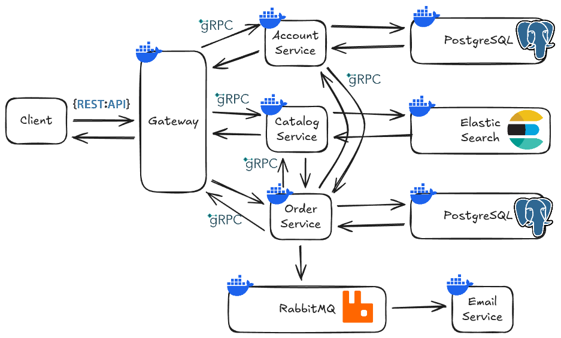

# Microservices + Pub/Sub Architecture
This project simulates an e-commerce platform. It does the following:
* PUBLIC ENDPOINTS
    * Account Sign Up
    * Account Login
    * Get All Products
    * Get Products By IDs
    * Get Product By ID
    * Search Products By Query
* BUYER ENDPOINTS
    * Account Create Order
    * Account Get Orders
* ADMIN ENDPOINTS
    * Create Products

This project uses `Microservices + Pub/Sub architecture`, completely written in Go.

`API Client` &rarr; I use [Bruno](https://www.usebruno.com/) for the API Client, the collection can be found in [this directory.](./microservices-api-client/)

# Layers
Account, Catalog, and Order services each has 3 layers:
* Server &rarr; gRPC server layer
* Service &rarr; business logic layer
* Repository &rarr; database layer

# Tech Stack
* Go
* gRPC
* Elastic Search
* RabbitMQ
* Docker

# Topology
Below is an overview of the whole program.



# Pre-requisites
You need these installed on your local machine (follow the docs):
* [Go](https://go.dev/doc/install)
* [Protobuf Compiler](https://protobuf.dev/installation/)
* [Go Plugins for Protobuf](https://grpc.io/docs/languages/go/quickstart/)
* [Docker Desktop](https://docs.docker.com/desktop/)

# How to Run The Project
After installing the above pre-requisites, simply run this command:
```bash
docker compose up
```
then wait until all services are up.

# Project Structure
```bash
.
├── account
│   ├── account.proto
│   ├── Dockerfile
│   ├── dto.go
│   ├── go.mod
│   ├── go.sum
│   ├── jwt.go
│   ├── main.go
│   ├── pb
│   │   ├── account_grpc.pb.go
│   │   └── account.pb.go
│   ├── repository.go               // database layer
│   ├── server.go                   // gRPC server layer
│   ├── service.go                  // business logic layer
│   └── up.sql
├── catalog
│   ├── catalog.proto
│   ├── Dockerfile
│   ├── go.mod
│   ├── go.sum
│   ├── main.go
│   ├── pb
│   │   ├── catalog_grpc.pb.go
│   │   └── catalog.pb.go
│   ├── repository.go               // database layer
│   ├── server.go                   // gRPC server layer
│   └── service.go                  // business logic layer
├── docker-compose.yaml
├── email
│   ├── Dockerfile
│   ├── dto.go
│   ├── go.mod
│   ├── go.sum
│   ├── main.go
│   └── send_email.go
├── gateway
│   ├── account_handler.go
│   ├── account_pb                  // to init account service client
│   │   ├── account_grpc.pb.go
│   │   └── account.pb.go
│   ├── catalog_handler.go
│   ├── catalog_pb                  // to init catalog service client
│   │   ├── catalog_grpc.pb.go
│   │   └── catalog.pb.go
│   ├── Dockerfile
│   ├── dto.go
│   ├── go.mod
│   ├── go.sum
│   ├── json.go
│   ├── jwt.go
│   ├── main.go
│   ├── middleware.go
│   ├── order_handler.go
│   └── order_pb                    // to init order service client
│       ├── order_grpc.pb.go
│       └── order.pb.go
├── Makefile
├── microservices-api-client        // Bruno API Client collection  
├── order
│   ├── account_pb                  // to init account service client
│   │   ├── account_grpc.pb.go
│   │   └── account.pb.go
│   ├── catalog_pb                  // to init catalog service client
│   │   ├── catalog_grpc.pb.go
│   │   └── catalog.pb.go
│   ├── Dockerfile
│   ├── dto.go
│   ├── go.mod
│   ├── go.sum
│   ├── main.go
│   ├── order.proto
│   ├── pb
│   │   ├── order_grpc.pb.go
│   │   └── order.pb.go
│   ├── publisher.go                // publish to RabbitMQ
│   ├── repository.go               // database layer
│   ├── server.go                   // gRPC server layer
│   ├── service.go                  // business logic layer
│   └── up.sql
└── README.md
```

# API Endpoints
Below is documentation for the API Endpoints.

## Sign Up
Registers a new user and returns a jwt token.

URL: `POST /api/signup`

Body:
```bash
{
  "email": "user@example.com", // email must be valid because email service will send message to this email
  "password": "securepassword123"
}
```

## Login
Authenticates a user and returns a jwt token.

URL: `POST /api/login`

Body:
```bash
{
  "email": "user@example.com", // email must be valid because email service will send message to this email
  "password": "securepassword123"
}
```

## Get Products
Fetches a list of products from Elastic Search. Supports filtering by specific IDs.

URL: `GET /api/products`

Query Params: ids=id1,id2 (optional)

## Get Product By ID
Get Product by specific ID.

URL: `GET /api/products/{id}`

## Search Products
Searches the Elasticsearch index for products matching a query string.

URL: `GET /api/products/search`

Body:
```bash
{ 
    "query": "laptop" 
}
```

## Create Order
Create a new order. **Upon success**, a message is sent to *RabbitMQ* to notify the Email Service.

URL: `POST /api/order`

Body:
```bash
{
  "products": [
    { 
        "id": "prod_123", 
        "quantity": 2 
    },
    { 
        "id": "prod_345", 
        "quantity": 3
    },
  ]
}
```

## List Orders
Retrieves all orders associated with the authenticated account.

URL: `GET /api/order`

## Create Product
Adds a new product to the Elastic Search index.

URL: `POST /admin/products`

Body:
```bash
{
  "name": "Gaming Mouse",
  "description": "RGB high-dpi mouse",
  "price": 59.99
}
```